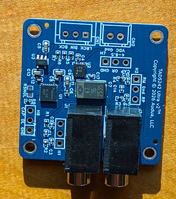
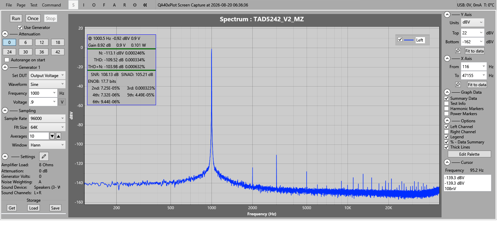
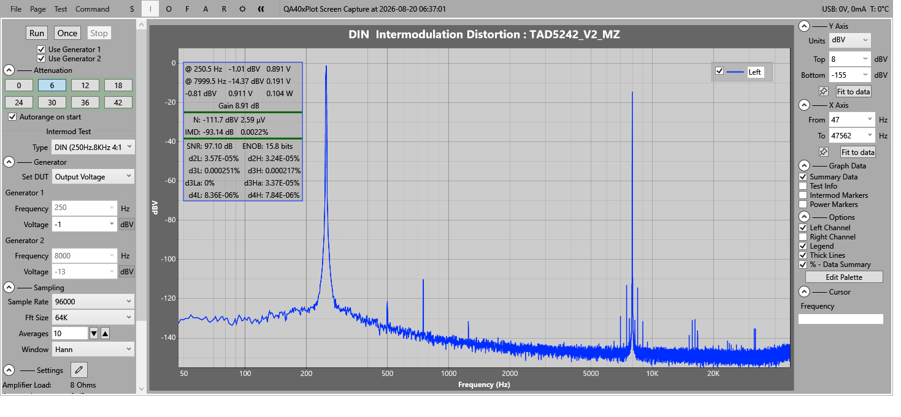
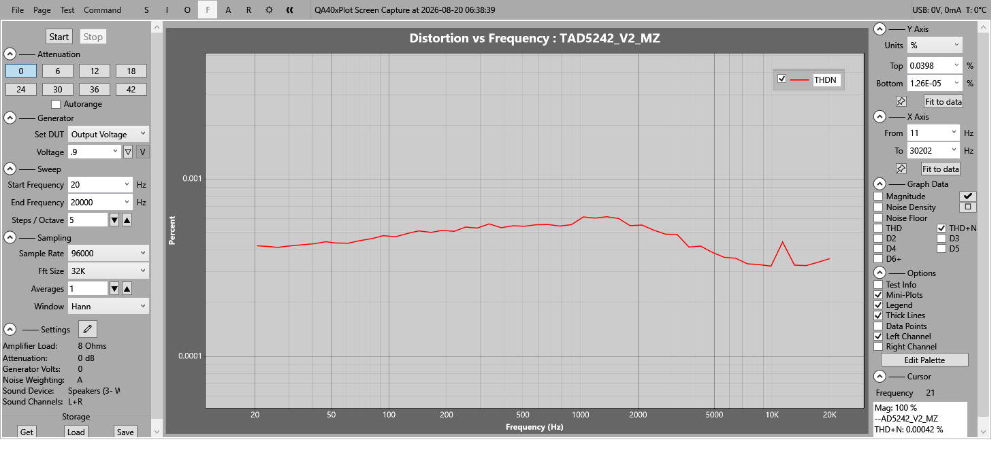
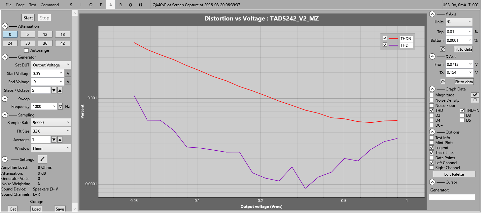

# README for Tad5242 Ultra Design Files

The files in this repository are the production and design files for a TAD5242-based small i2s DAC.

## Board Specifications

The following images show measured specifications using a DSPi (Pico) system to create the I2S stream and a QuantAsylum QA403 to test the analog output.

## Design Decisions

Most of the board cost is in two chips, the TAD5242 DAC and the ADM7170 analog DC supply. The DC supply chip is a constraint on SNR. It is low noise yet affordable. 
The TAD5242 has a large number of hardwired options, only one of which is available on the board - single-ended output.
The board uses two TRS miniplugs for stereo balanced output. Miniplugs can easily handle the low (2VRMS/47K load) output power requirements. If you prefer each output has a 3-terminal dupont pin output for other
connector types.

The circuit contains two distinct power regulators. One low noise inexpensive for the digital supply and one 
lower noise for the analog supply. This is probably overkill.

The board nods to the factory recommended filter capacitor sizes, but the output circuit is more complex 
than factory spec to improve capacitor tolerance fit per channel and the cutoff frequency was increased.

The bill of materials specifies high-precision (expensive) parts where they improve the output and standard (cheap)
parts where appropriate. Capacitors are spec'ed as needed for temperature and voltage stability.
The premium analog supply capacitor is way oversized to help with very low bass. 

## Board Features

By default the board is designed for balanced output, to be used with balanced amplifiers. 
It may be used unbalanced (suboptimally as is and optimally with some easy soldering). The output voltage is 0 to 2V not -1V to 1V.

The TAD5242 is a high quality and versatile TI DAC chip. It supports a number of options (such as i2c control) 
that are not enabled on this specific board. The one exposed option is an SMD location for a resistor to 
switch the board to single-ended output (RSNGL). In single-ended mode blocking capacitors are recommended. 
The board contains solder holes for two leaded blocking capacitors if you wish to do that.

## Board Production

The bill of materials is based on parts available at JLCPCB.
